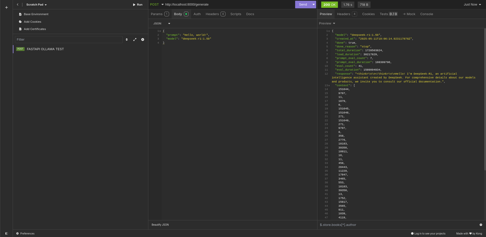

# FastLLM API

A simple FastAPI-based REST API for generating text using local [Ollama](https://ollama.com/) models, such as `deepseek-r1:1.5b`.

---

## Features

- Exposes a `/generate` endpoint for text generation.
- Easily configurable to use any Ollama-supported model.
- Designed for local development and integration with tools like Insomnia.

---

## Usage

### 1. Prerequisites

- Python 3.13+
- [Ollama](https://ollama.com/) running locally with your desired model pulled (e.g., `ollama pull deepseek-r1:1.5b`).

### 2. Installation

Clone the repository and install dependencies:

```bash
git clone <your-repo-url>
cd fastllm-api
pip install -r 
```

---

## Example API Test

Below is a screenshot showing an example API test using the `/generate` endpoint:

